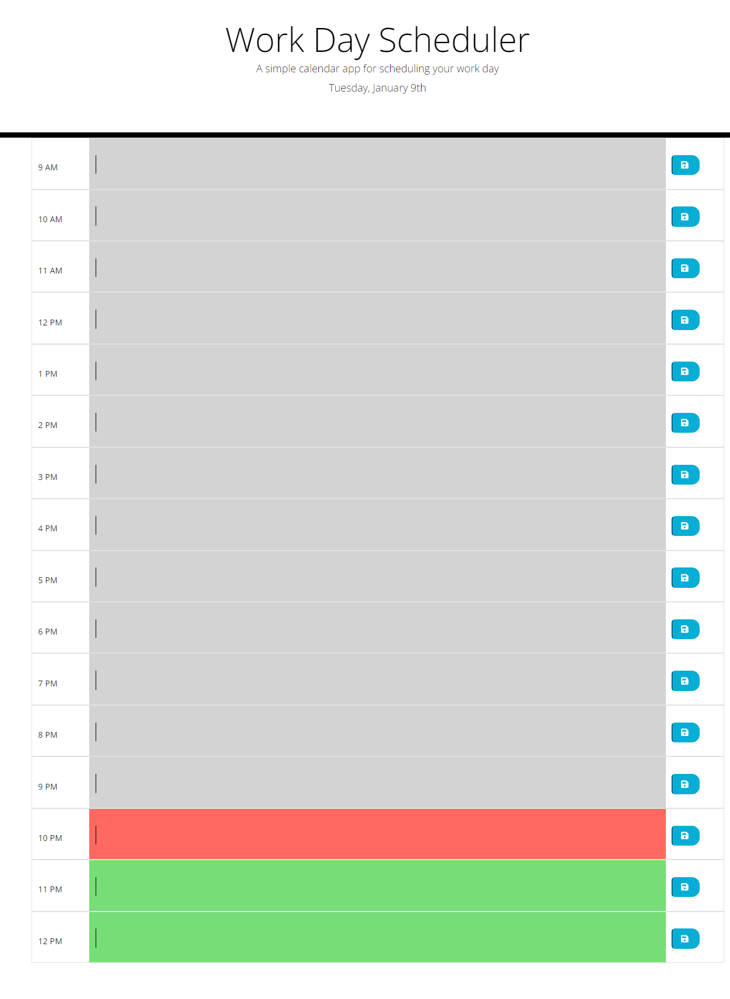

# Work Day Scheduler - README
- The Work Day Scheduler is a simple calendar application designed for employees with busy schedules. Built using HTML, CSS, and JavaScript, it leverages third-party APIs such as jQuery and Day.js to create a dynamic user experience. The application runs in the browser and offers a straightforward interface for managing daily events and appointments.

## Screenshot

## Links
- https://github.com/6nhuseyin/work-day-scheduler
- https://6nhuseyin.github.io/work-day-scheduler

## Features
- Display Current Day: Shows the current day at the top of the calendar for easy reference.
- Timeblocks for Business Hours: Presents timeblocks for standard business hours, allowing for scheduling throughout the day.
- Color-Coded Timeblocks: Automatically color-codes each timeblock to indicate past, present, and future times, enhancing visual organization.
- Event Entry: Enables users to click on a timeblock to enter an event or appointment.
- Local Storage Integration: Saves events in local storage when the save button is clicked, ensuring data persistence.
- Data Persistence: Maintains events between page refreshes, providing a seamless user experience.

## Usage
- Open the application to view the current day displayed at the top.
- Scroll through the timeblocks.
- Click on a timeblock to enter an event or appointment.
- Click the save button next to the timeblock to store the event in local storage.
- Events will remain visible even after refreshing the page.

## Technologies Used
- HTML
- CSS
- JavaScript
- jQuery
- Day.js Library